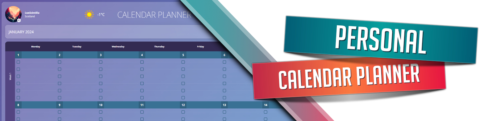

# Calendar Planner

### Languages and Tools used in this project

 

### Additional Info

  WIP! After finishing 3 courses on Udemy for HTML, CSS, Sass, and JavaScript, I decided it was time to build a bigger personal project. This project combines creating a calendar from scratch, building on the to do list by being able to attach tasks spread throughout the calendar, using sass maps and mixins to create a theme switcher, and finally also utilizing a weather API that shows you the current weather information.
  <a href="https://calendar-planner-ef.netlify.app/">Link to the live website.</a>

